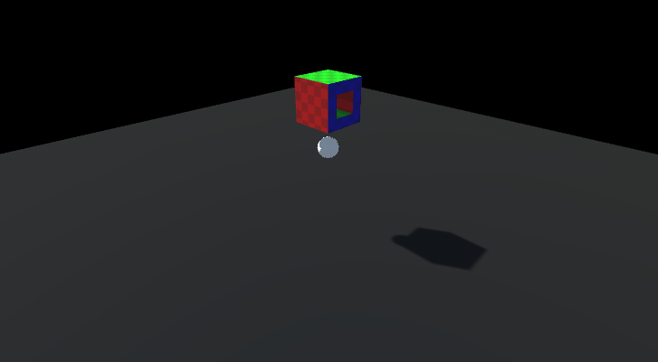

# COMP3180 Realtime Cell Fracturing

Included is a rough timeline below. Fill this in from week to week to show your progress throughout semester.

## Week 1 - Selecting a Project

Complete the "Choose a Topic" survey in iLearn and paste the details here.

Realtime cell fracturing of meshes within Unity

## Week 2 - Familiarising yourself with the tools

You need to have accepted this assignment repo and made a post here identifying a resource relevant to your topic.

### Research
#### Methods:

- Voronoi based fracturing
- Tetrahedral finite element method
- Point based fracturing
- Ray/line based fracturing

#### Papers:

##### Voronoi based

[Real time dynamic fracture with volumetric approximate convex decompositions | ACM Transactions on Graphics](https://dl.acm.org/doi/epdf/10.1145/2461912.2461934)

##### Tetrahedral based

[(PDF) Adaptive Tetrahedral Meshes for Brittle Fracture Simulation](https://www.researchgate.net/publication/262488595_Adaptive_Tetrahedral_Meshes_for_Brittle_Fracture_Simulation)

[Cutting Meshes in Unity](https://youtu.be/1UsuZsaUUng)

[How To Slice Meshes In Unity](https://youtu.be/BVCNDUcnE1o)

[Procedural Destroy in Unity - Lazy Tutorial](https://youtu.be/VwGiwDLQ40A)

## Week 3 - Reading and prototyping

- Setup preexisting mesh cutting solution.
- Optimised and improved readability of solution.
- Setup performance tracking
- Changing to focus on voxel meshes (only comprised of cubes)
- Developing editor tools

  
*Implementation of preexisting fracturing solution on concave mesh*

## Week 4 - Reading and prototyping
- Starting working on voxel mesh file format
- Created voxel mesh generator with optimisations to not create inner faces
- Fixed mesh normals through vertex doubling.
- Started working on in editor voxel creation tool

Wireframe Voxel | Rendered Voxel | Fixed Normals
:-----:|:-----:|:------:
 |  | 

## Week 5 - Presentations
- Worked on presentation

## Week 6 - Presentations
- Added vertex colors to mesh
- Created new file parser with colour support
- Added export option from editor tool to save voxel to file

## Week 7 - Finalising your Research Report
- Research report
- Refactored entire project (it now works better. trust)
- Wrote documentation for key scripts/file formats

## Mid-semster break 1
- nothing

## Mid-semster break 2
- nothing

## Week 8 - Developing your Project
- Working on point based fracturing (instead of fracturing an entire model)

- Working on generation of colliders
    - Optimisation of collider shapes
    - Decreasing amount of colliders

## Week 9 - Developing your Project
- Updated VoxelRenderer to live update
- Removed need for VoxelManager. All Voxel rendering process now happens in voxel renderer
- Added performance visualisation GUI
- Added performance test scene
- Mesh generation memory optimisation

## Week 10 - Developing your Project

## Week 11 - Evaluation

## Week 12 - Evaluation

## Week 13 - Finalising your Project Report and Deliverables

